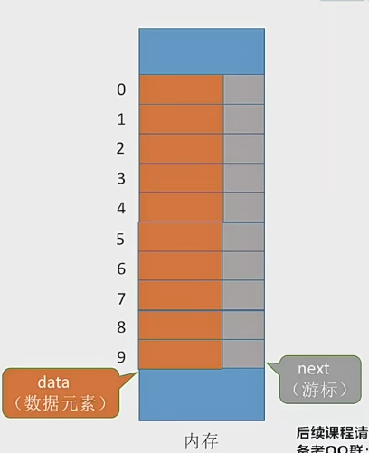

### 什么是静态链表
分配一整片连续的内存空间，各个节点集中安置


静态链表就是用数组的方式实现链表

优点： 增删操作不需要大量的移动元素
缺点： 不能随机存取，只能从头节点开始一次往后查找，容量固定不可变

适用场景：
1. 不支持指针的低级语言
2. 数据元素数据量固定不变的场景

### 如何定义一个静态链表
```c
#define MaxSize 10
struct Node{
	ElemType data;
	int next;     // 下一个元素的数组下标
}

void testSLinkList(){
	struct Node a[MaxSize];
}

// 另一种写法
#define MaxSize 10
typedef struct Node{
	ElemType data;
	int next;     // 下一个元素的数组下标
} SLinkList[MaxSize];
// 这种写法等价于
#define MaxSize 10
struct Node{
	ElemType data;
	int next;     // 下一个元素的数组下标
};

typedef struct Node SLinkList[MaxSize];
// 可以用 SLinkList定义 一个长度为 MaxSize 的 Node 数组

void testSLinkList(){
	SLinkList a;
}
```


### 简述基本操作的实现
```c
// 初始化 a[0]的next要设置为-1，并把空闲节点标记出来，可以把位序设置成-2等能表现功能的数字
// 查找： 从头节点出发挨个往后遍历节点 时间复杂度 O(n)
// 插入位序为i的节点：
// 1 找到一个空节点存入数据元素
// 2 从头节点出发找到位序为 i-1 的节点
// 3 修改新节点的next (新节点的next应该为-1)
// 4 修改 i-1 号节点的next

// 删除某个节点:
// 1 从头节点出发找到前驱节点
// 2 修改前驱节点的游标
// 3 被删除节点的 next 设置为 -2
```