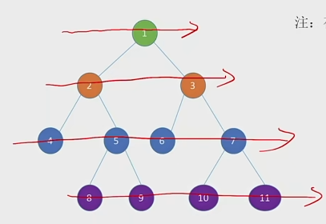
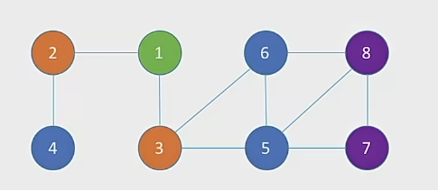

### 队列
队列 Queue 是只允许在一段进行插入，另一端进行删除的线性表


重要术语：队头、队尾、空队列

特点 先进先出

### 基本操作
1. InitQueue(&Q) 初始化队列，构造一个空队列Q
2. DestroyQueue(&Q) 销毁队列 销毁并释放队列Q所占用的内存空间
3. EnQueue(&Q,x) 入队，若队列Q未满，将x加入，使之成为新的队尾
4. DeQueue(&Q,&x) 出队，若队列Q非空，将队头元素删除，并用x返回
5. GetHead(Q,&x) 读队头元素，若队列Q非空，则将队头元素赋值给x

#### 队列的顺序实现
```cpp
typedef struct {
	ElemType data[MaxSize];
	int front, rear;
}SqQueue;

// 解决空间浪费问题
typedef struct {
	ElemType data[MaxSize];
	int front, rear;
	int size;
}SqQueue1;
```

#### 双端队列
只允许从两端插入、两端删除的线性表

引出输入受限的双端队列和输出受限的双端队列

考点：判断输出序列合法性

若输入元素为1 2 3 4  则输出序列的排列种类有 A上4下4种输出序列

### 队列的应用
 - 树的层次遍历



新建立一个队列来遍历各个节点

首先遍历的是根节点也就是1号节点，然后我们要把一号节点的左右两个孩子节点放到队列的队尾，左是2 右是3

然后我们就可以从队列中删除1号节点，然后下一步我们要检查的就是当前的队头节点，2号节点

我们要把2号节点的左右孩子节点加入到队尾，也就是左孩子4 右孩子5 依次加入队尾，并把2出队

然后就是3号节点为队头，进行遍历，以此类推

---

 - 然后就是图的广度优先遍历


图会详细学习

从1号节点出发  新建一个队列

首先遍历1号节点，我们看到1号节点有两个连接的节点，2 3 入队

1 -> 2 -> 3

然后1号节点已经没东西了，就可以出队 变成 2 -> 3

然后2号节点就是队头节点了，我们要看2号节点是否有没被处理过的节点,我们可以发现2号节点连接的节点有1和4，但是1号节点已经处理过了
所以我们只有一个4号节点符合需求

2 -> 3 -> 4，接下来2号节点就可以出队

3 -> 4  然后我们现在就要处理队头的3号节点了，它有1，5，6 三个相邻节点，然后1号节点已经处理过了，所以将5、6号节点入队，3号节点出队

4 -> 5 -> 6 然后按照上面的逻辑以此类推  直到遍历完所有节点

---

 - 操作系统中的应用

多个进程争抢着使用有限的系统资源是，FCFS 先来先服务是一种常用策略

比如说cpu分配时间片


