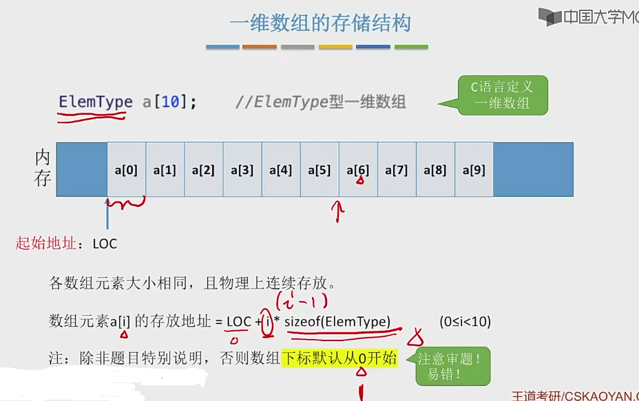
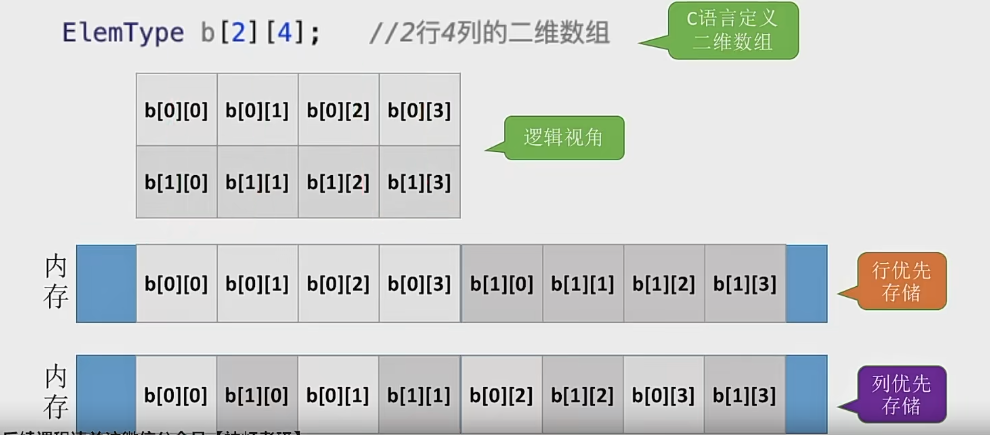
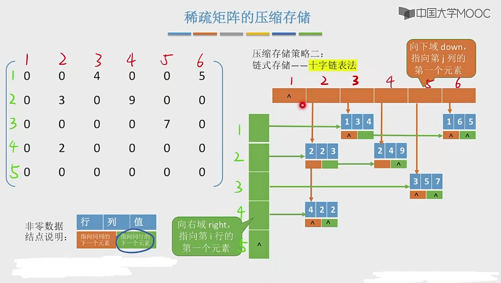

# 矩阵的压缩存储

### 数组的存储结构

#### 一维数组

#### 二维数组

M行N列的二维数组b[M][N]中，若按行优先存储，则b[i][j]的存储地址为 LOC+(i*N+j) * sizeof(ElemType)

M行N列的二维数组b[M][N]中，若按列优先存储，则b[i][j]的存储地址为 LOC+(i+j*M) * sizeof(ElemType)

---

### 普通矩阵
可以直接用二位数组存储

---

### 特殊矩阵
某些特殊的矩阵可以压缩存储空间  如下所示

#### 对称矩阵
n阶方正，任意一个元素 ai j 都有 aij = aji 

压缩策略：只存储主对角线或者 上/下 三角区中的一个

 - 主对角线+下三角区
可以按照行优先原则将各元素存入一维数组中

思考
1. 数组大小应该为多大？  1+2+3+...+n 等差数列
1. 站在程序员角度，对称矩阵压缩存储后如何方便使用？ 可以实现一个“映射函数”  矩阵下标 --> 一维数组下标  **重要**

aij (i>=j 时)是第几个元素？  第 i(i-1)/2 + j 个元素，然后因为下标减一  所以索引k为 i(i-1)/2 + j - 1 [如果索引下标从1开始，那就不用减这个1]

aij (i<j 时)是第几个元素？  第 j(j-1)/2 + i 个元素，然后因为下标减一  所以索引k为 j(j-1)/2 + i - 1 [如果索引下标从1开始，那就不用减这个1]

#### 三角矩阵
除了上/下三角区和主对角线外，其他的元素都相同

下三角矩阵：

压缩策略：按行有限原则将非常数区域元素存入一维数组中，并在最后一个位置存储常量c

i >= j 时 k = i(i-1)/2 + j - 1    || i < j 时  i < j 这个就是上三角区元素  k = i(i-1)/2 + j

**下三角存储**：aij 和 存储索引 k 的关系：  k = i(i-1)/2 + j - 1

**上三角存储**：aij 和 存储索引 k 的关系：  K = (i-1)*(n+n-i+2)/2 + j - i - 1

#### 三对角矩阵
也就是带状矩阵，挨着主对角线的数字都为正常矩阵数，其他的全为0

即 |i-j| > 1 时， aij = 0

压缩策略：行优先原则，只存储带状部分

知道aij如何推算K
1. aij -> 先计算前 i - 1 行元素个数: k = 3(i-1) - 1 ( 因为第一行只有两个元素  所以要额外减一个1)
2. aij -> 分析列，我们知道对角线左边会先进数组，所以 j-i = -1 的时候是第i行的第一个元素，j-i=0 的时候，是第i行的第二个元素，j-i=1的时候是第i行的第三个元素，所以第几个元素就要加几 => j - i + 2 => 前面三个元素变成1 2 3号
3. aij -> K = k + j - i + 2 = 2i + j - 2 （如果下标从0开始要多一个 -1）

知道k如何推算i j
1. 3(i-1) - 1 < k <= 3i - 1
2. i >= (k+1)/3
3. 向下取整所以 i = (k+1)/3
4. 算 j = k - 2i + 2 [+ 1]

#### 稀疏矩阵
非零元素的个数远远少于矩阵的个数

压缩策略：
顺序存储 -- 三元组<行、列、值> (用一个struct i j v 进行顺序存储)

把稀疏矩阵变成n个三元组，n个三元组组成了一个三元组表，然后我们还需要记录这个矩阵的行数、列数和非零元的个数

链式存储 -- 十字链表法

### 广义表
广义表是线性表的推广，其元素可以是单个元素，也可以是广义表，分别称为原子和子表。

LS = (a1,a2,...,an)

也可以用树形结构表示

广义表通常记作:LS =(a1,a2,...,an).
其中: LS为表名， n为表的长度， 每一个 ai为表的元素

表头： 若 LS非空(n21)，则其第一个元素 a 就是表头
记作head(LS) = a1注: 表头可以是原子，也可以是子表

表尾： 除表头之外的其它元素组成的表。记作 tail(LS) = (a2, ... an)

注:表尾不是最后一个元素，而是一个子表

性质:
1. 广义表的数据元素也是有相对次序的，也就是说广义表的元素也有直接前驱和一个直接后继
2. 广义表的长度定义为最外层所包含元素的个数
3. 广义表的深度是最深有多少层括号，也就是展开后所含括号的重数
4. 原子的升读为0，空表的深度为1
5. 广义表可以为其他广义表共享
6. 广义表也可以是一个递归的表
    递归表的深度是无穷值，但长度是有限的
7. 广义表是多层次的结构，广义表的元素可以是单元素，也可以是子表(可以用树型结构表示)

广义表可以看成是线性表的推广线性表是广义表的特例。

广义表的结构相当灵活，在某种前提下，它可以兼容线性表、数组树和有向图等各种常用的数据结构。

当二维数组的每行 (或每列)作为子表处理时，二维数组即为一个广义表。

另外，树和有向图也可以用广义表来表示

由于广义表不仅集中了线性表、数组、树和有向图等常见数据结构的特点，而且可有效地利用存储空间，因此在计算机的许多应用领域都有成功使用广义表的实例。