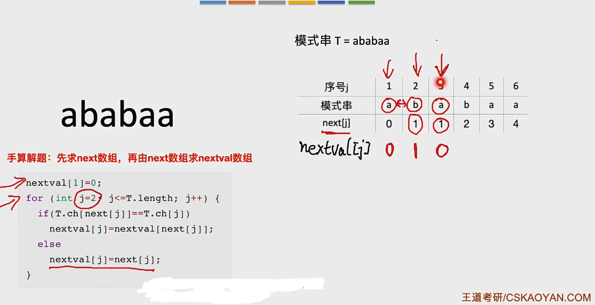

## 串的定义
串是由零个或者多个字符组成的有限序列

串，即字符串 string 是由零个或多个字符组成的有限序列。一般记为 S = 'a1a2a3...an'

其中，S是串名，单引号括起来的字符序列是串的值，ai可以表示字母、数字或者其他字符；串中字符的个数n称为串的长度。n=0时的串称为空串。

S = "ding zhen xi huan rui ke 5"
T = "wang yuan ai chou fu rong wang"

子串：串中任意个连续的字符组成的子序列
主串：包含字串的串
字符在主串中的位置：字符在串中的序号(如果一个字符多次出现，一般只探讨第一次出现的位置)
子串在主串中的位置：子串的第一个字符在主串中的位置

串是一种特殊的线性表，数据元素之间呈现线性关系

串的数据对象限定为字符集（例如：中文字符、英文字符、数字字符、标点字符等）

串的基本操作，如增删改查等通常以子串为操作对象


### 基本操作
1. StrAssign(&T, chars) 赋值操作。把串T赋值为chars
1. StrCopy(&T,S) 复制操作，由串S赋值得到串T
1. StrEmpty(S) 判空
1. StrLength(S) 求串长，返回串S的元素个数
1. ClearString(&S) 清空操作
1. DestroyString(&S) 销毁串，回收存储空间
1. Concat(&T,S1,S2) 串连接，用T返回S1和S2连接而成的新串
1. SubString(&Sub,S,pos,len) 求字串，用Sub返回串S的第pos个字符起长度为len的子串
1. Index(S,T) 定位操作，若S中存在与T相同的字串，发生你会它在主串S中第一次出现的位置，若不存在则返回0
1. StrCompare(S,T) 比较操作，若S>T 则返回 >0；若S=T 则返回 =0；若S<T 则返回<0

### 串的存储结构

#### 顺序存储
```cpp
#define MaxLen 255;
typedef struct {
	char ch[MaxLen];
	int length;
}SString;
```
串的顺序存储三种方案：
1. 添加变量length   需要多一个字节存储length
1. ch[0]充当length，字符的位序和数组下标相同
1. 没有length变量，以字符"\0"表示结尾，对应ASCII码的0

结合方案一和方案二，教材用的方案4，ch[0]不用，然后也由一个变量length存储字节长度

#### 链式存储
```cpp
typedef struct {
	char ch;
	struct StringNode *next;
}StringNode, *String;
```
存储密度低，每个字符1B，每个指针4B

```cpp
typedef struct {
	char ch[4];
	struct StringNode *next;
}StringNode, *String;
```
这样优化  提升存储密度

#### 基于顺序存储实现基本操作


### 字符串的模式匹配
什么是字符串的模式匹配？

在主串中找到与模式串相同的字串，并返回其所在位置

主  串：“abcdefghiklmnopqrstuvwxyz”
模式串：“efghi”

主串就是被检索的对象，模式串就是需要检索的内容

### 朴素模式匹配算法
说白了就是暴力解法

假设模式串长度为6，我就把主串中所有长度为6的字串都拉出来和模式串比较，哪个对上了就返回，没对上就返回没检索到。

### kmp匹配算法
基于朴素模式匹配算法的优化

因为比较到第n个元素失败，则前n-1个内容是已经知晓的，所以我们要判断应该从哪里开始，这里的信息要对模式串进行比较

减少重复比较本来已有就不匹配的信息

比如 abaabc 在第六个元素匹配失败，我们知道1 2 开头是ab，主串第六个之后的内容为未知，所以我们下一步比较一定是从主串的6号开始，模式串回到3号

步骤：
1. 首先要求出模式串的 next 数组(也就是匹配到第几个字符的时候模式串需要回溯到哪个位置)
1. 然后在实现朴素匹配的基础上，将i j 的修改逻辑改为， j = next[j] i不变即可
1. 然后在做判断处理的时候，要考虑到 j == 0的情况，当 j==0 时，也要让i j 同时 ++

在考研中，这个next数组都是手算  不用写代码实现

#### KMP 算法优化-> 优化next数组
(考试的时候要看清楚是next数组 还是nextval数组)

nextval数组只需要去判断下一个去比较的字符是否和原来比较过的字符一致，如果一致的话就要改为next的next


