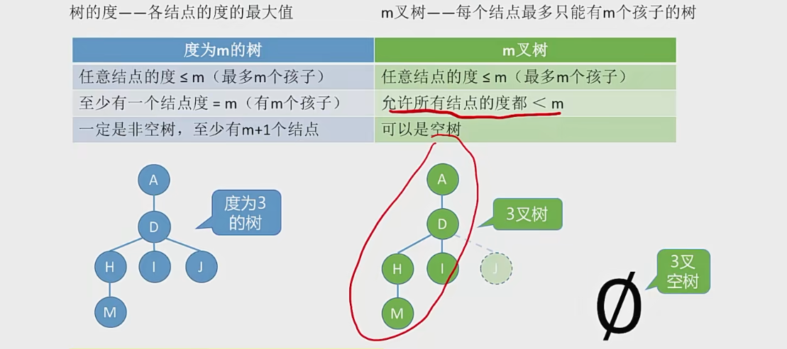

# 树

### 基本概念
空树和非空树

空树--结点数为0的树

非空树--有且仅有一个根节点

树：除了根节点外，其他的任何一个结点有且仅有一个前驱结点

数是n个结点的有限集合，n=0时，称为空树，这是一种特殊情况。在人以一颗非空树中应满足：
1. 有且仅有一个特定的称为根的结点
1. 当n>1时，其余结点可分为m个互不相交的有限集合，T1，T2,...,Tm，其中每个集合本身又是一棵树，并称为根节点的子树

树的应用：文件系统，思维导图 等等

### 基本术语

#### 结点之间的关系描述
1. 祖先结点
1. 子孙结点
1. 双亲结点\父结点
1. 孩子结点
1. 兄弟结点
1. 堂兄弟结点

#### 结点、树的属性描述
1. 结点的层次\深度  -- 从上往下数
1. 结点的高度 -- 从下往上数
1. 树的高度\深度 -- 总共有多少层
1. 结点的度 -- 有几个孩子结点
1. 树的度 -- 各结点的度的最大值

#### 有序树、无序树
有序树 -- 逻辑上看，树中结点的各子树从左到右是有次序的，不能互换

无序树 -- 逻辑上看，树中结点的各子树从左到右是无次序的，可以互换

#### 森林
森林是m棵互不相交的树的集合

#### 树的常考性质
1. 结点数 = 总度数 + 1. 结点的度=结点有几个孩子 + 一个根节点
2. 度为m的树和m叉树的区别。树的度：各结点的度的最大值；m叉树：每个结点最多只能由m个孩子的树

3. 度为m的树第i层至多有 m^(i-1) 个结点，m叉树第i层至多有 m^(i-1)个结点
4. 高度为h的m叉树至多有 (m^h - 1)/(m - 1) 个结点
5. 有n个结点的m叉数最小高度为[log.m(n*(m-1)+1)]

### 二叉树
二叉树是n个结点的有限集合：
1. 空二叉树 n = 0
1. 由一个根节点，和两个互不相交的被称为根的左子树和右子树组成，左子树和右子树有分别是一棵二叉树

特点
1. 每个结点至多由两个子树
1. 左右子树不能颠倒，二叉树是有序树

#### 几个特殊的二叉树

##### 满二叉树
除了叶子节点外，其他的分支结点都长满了两个结点的二叉树

高度为h，则含有2^h - 1 个结点的二叉树

特点:
1. 只有最后一层有叶子结点
1. 不存在度为1的结点
1. 按层序从1开始编号，结点i的左孩子为2i，右孩子为2i+1；结点i的父节点为 i/2 向下取整

##### 完全二叉树
当且仅当每个结点对于高度为h的满二叉树中编号为1-n的结点一一对应时，称为完全二叉树

(也就是说满二叉数如果有 15个结点，编号为 1-15，然后完全二叉树可能只有12个结点，少几个)

其实也就是不能有两个度为1的结点

特点：
1. 只有最后两层可能有叶子节点
1. 最多只有一个度为1的结点
1. 按层序从1开始编号，结点i的左孩子为2i，右孩子为2i+1；结点i的父节点为 i/2 向下取整

##### 二叉排序树
一棵二叉树或者说空二叉树，或者是具有如下性质的二叉树：
1. 左子树上所有结点的关键字均小于根结点的关键字；
1. 右子树上所有结点的关键字均大于根节点的关键字；
1. 左子树和右子树又各是一颗二叉排序树

##### 平衡二叉树
树上任一结点的左子树和右子树的深度只差不超过1

### 常考性质拓展

#### 常见考点1：设非空二叉树中度为0、1、2的结点个数分别为 n0,n1,n2，则n0=n2+1
(叶子节点比二分直接点多一个)

假设树中的结点总数为n，则：
1. n = n0 + n1 + n2
1. n = n1 + 2n2 + 1

#### 常见考点2：二叉树和m叉树的i层
1. 二叉树第i层有 2^(i-1)个结点
1. m叉树第i层有 m^(i-1) 个结点

#### 完全二叉树常考
1 具有n个结点的完全二叉树高度h为 log.2(n+1) 或者 log.2(n) + 1

2 对于完全二叉树，可以由结点数n推出度为0、1和2的节点个数为 n0,n1和n2

完全二叉树最多只有与i个度为1的结点  也就是 n1 = 0 或 1
n0 = n2 + 1 -> n0 + n2 一定是奇数

如果完全二叉树有偶数个结点，则必有 n1 = 1， n0 = k， n2 = k-1


#### 二叉树的存储结构

##### 顺序存储
常考的基本操作:
- i的左孩子   --- 2i
- i的有孩子   --- 2i+1
- i的父节点   --- [i/2]
- i所在的层次 --- log.2(n+1) 或者 log.2(n) + 1

若完全二叉树中共有n个结点，则
- 判断i是否有左孩子？             2i <= n?
- 判断i是否有右孩子？             2i + 1 <= n?
- 判断i是否是 叶子\分支 结点？    i > [n/2]

不是完全二叉树的话，用顺序存储是没办法表达各个结点之间的逻辑关系的
所以对于普通的二叉树我们不能直接用顺序存储

二叉树的顺序存储中，一定要吧二叉树的节点编号与完全二叉树对应起来

就把那些不存在的结点也要赋予编号，对于非完全二叉树的话，判断左右结点就要看那个编号的结点查看isEMpty来判断有没有结点

最坏情况：高度为h且只有h个结点的单支树(所有结点只有右孩子)，也需要2^h-1个存储单元

结论：二叉树的顺序存储结构，只适合存储完全二叉树

##### 链式存储
```cpp
typedef struct BiTNode {
	ElemType data;
	struct BiTNode* lchild, * rchild;
}BiTNode, *BiTree;
```
n个结点的二叉链表共有n+1个空链域，也就是左右指针指向 NULL （后续会学用这些空指针构造线索二叉树）

链式存储找到左右孩子结点很简单，但是想要找到父节点  就只能从根结点开始遍历寻找

如果需要方便找到父节点的话，我们就定义一个三叉链表，方便找到父节点

```cpp
typedef struct BiTNode {
	ElemType data;
	struct BiTNode* lchild, * rchild;
	struct BiTNode* parent;
}BiTNode, *BiTree;
```

### 二叉树的 先\中\后 序遍历

#### 先序遍历
根节点 -> 左子结点 -> 右子结点

或者这么说：父节点 -> 左子结点 -> 右子结点

#### 中序遍历
左子节点 -> 父结点 -> 右子结点

#### 后序遍历
左子节点 -> 右子结点 -> 父结点

### 二叉树的层序遍历
算法思想：
1. 初始化一个辅助队列
1. 根节点入队
1. 若队列非空，则队头结点出队，访问该节点，并将其左右孩子入队 （如果有左右孩子的话）
1. 重复上一点 直到队列为空

### 由遍历序列构造二叉树
中序遍历：中序遍历左子树，根节点，中序遍历右子树

单给一个遍历序列，不能唯一确定一颗二叉树

如果给中序遍历 + 前、后 序遍历+层序遍历中的任意一种遍历序列，就能判断二叉树了
